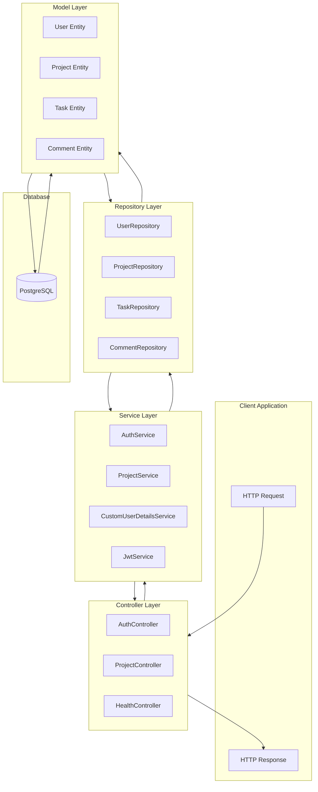
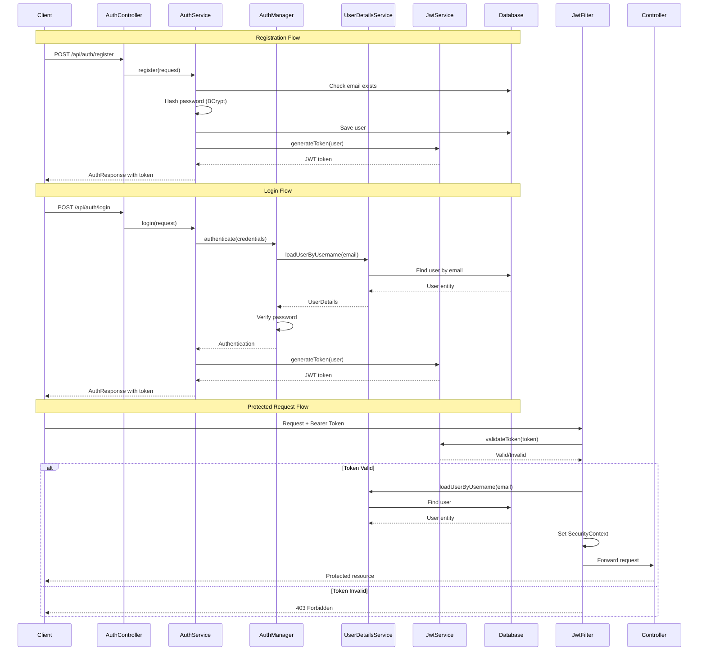
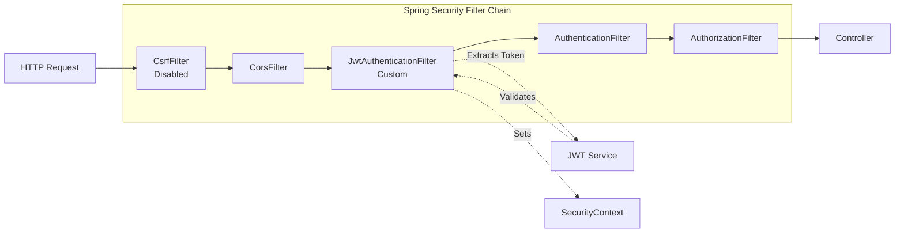
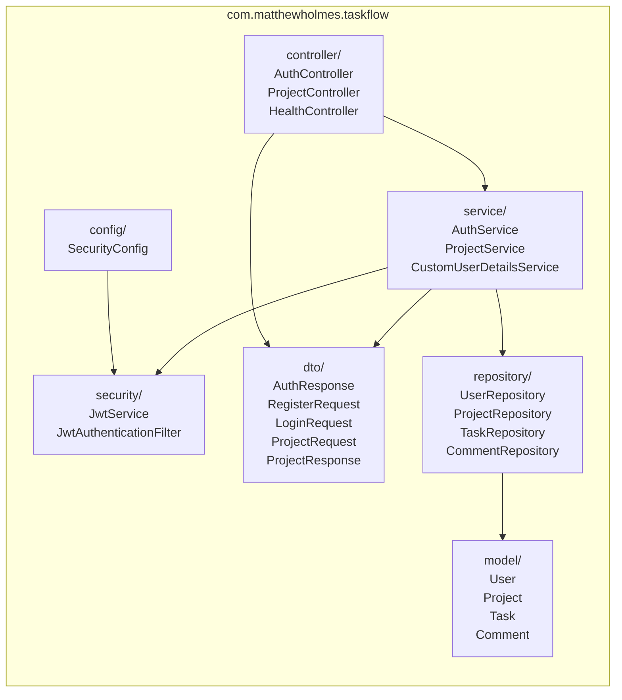
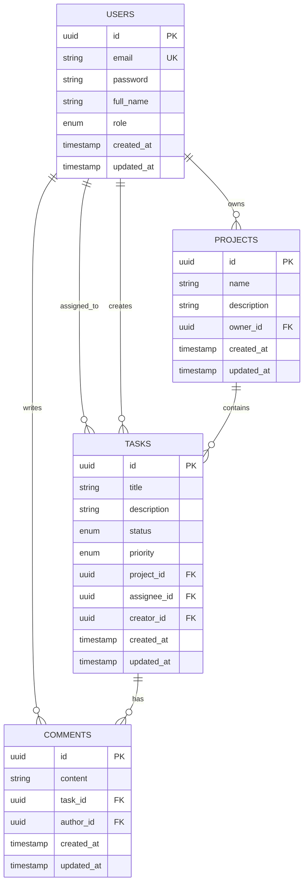
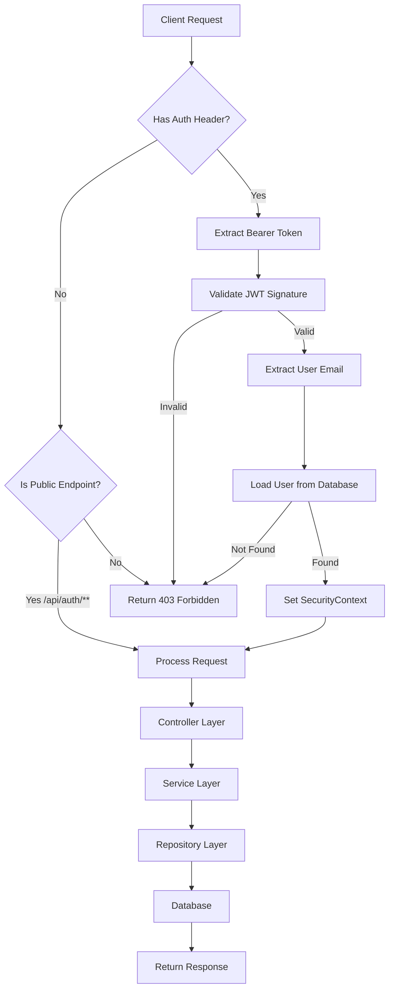
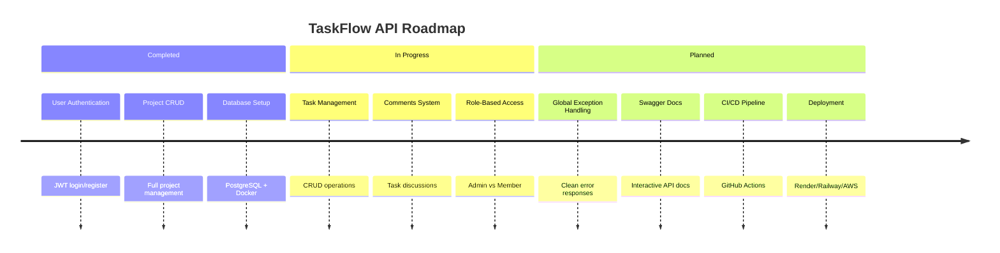

# Taskflow API
[](https://www.oracle.com/java/)
[](https://spring.io/projects/spring-boot)
[](https://www.postgresql.org/)
[](https://www.docker.com/)

A **production-style** task management REST API built with modern Java and Spring Boot. Designed to demonstrate professional backend architecture, secure authentication, and containerized development.

## 📋 Overview

TaskFlow API is a multi-user task management backend inspired by tools like Jira and Trello. It provides a secure REST API for user authentication, project management, and task organization.

This project was built to showcase:
- **Clean Architecture**
- **Production-ready** Spring Boot configuration
- **Stateless authentication** using JWT
- **Containerized development** with Docker Compose
- **Modern Java features**

---

## 🧱 Tech Stack

| Category | Technology | Version |
|----------|------------|---------|
| **Language** | Java | 25 LTS |
| **Framework** | Spring Boot | 4.0.5 |
| **Security** | Spring Security + JWT | 6.5+ |
| **Database** | PostgreSQL | 15 (Alpine) |
| **ORM** | Spring Data JPA / Hibernate | - |
| **Build Tool** | Maven | - |
| **Containerization** | Docker + Docker Compose | - |
| **Utilities** | Lombok | - |

---

## ✨ Features

### ✅ Implemented

| Feature | Description |
|---------|-------------|
| **User Registration** | Create new account with email/password |
| **User Login** | Authenticate and receive JWT token |
| **JWT Authentication** | Stateless, secure token-based auth |
| **Project CRUD** | Create, read, update, and delete projects |
| **User-Project Association** | Each project belongs to an owner |
| **Input Validation** | Request validation with meaningful error messages |
| **Password Encryption** | BCrypt hashing for secure storage |
| **Containerized Database** | PostgreSQL running in Docker |

### 🚧 In Progress

| Feature | Status |
|---------|--------|
| Task Management (CRUD) | Entities & Repos Complete |
| Comments System | Entities & Repos Complete |
| Role-Based Access Control | Coming Soon |
| Global Exception Handling | Coming Soon |
| API Documentation (Swagger) | Coming Soon |

---

## 🏗️ Architecture

### Layered Architecture Flow



### Security Authentication Flow



### JWT Authentication Filter Chain



### Package Structure



### Entity Relationship Diagram



### Request Processing Flow



## 🏃 Quick Start

### Prerequisites
- **Java 25** or higher
- **Docker Desktop** (for PostgreSQL)
- **Maven**

### Step 1: Clone the repository
```bash
git clone https://github.com/matayoh14/taskflow-api.git
cd taskflow
```

### Step 2: Start PostgreSQL with Docker
```bash
docker-compose up -d
```
#### Verify it's running:
```bash
docker ps
```

### Step 3: Run the Application
```bash
./mvnw spring-boot:run      # Mac/Linux
mvnw.cmd spring-boot:run    # Windows
```
#### Or using IDE:
Run TaskflowApplication.java as a Java application.

### Step 4: Test the API
The sever starts on http://localhost:8080

---

## 📡 API Documentation

### Base URL
http://localhost:8080/api

### Authentication Endpoints

#### Register New User
Creates a new user account.

| Method | Endpoint | Description | Auth Required |
|--------|----------|-------------|---------------|
| POST | `/auth/register` | Register new user | No |
| POST | `/auth/login`    | Login, returns JWT | No |

**Register Request Body:**
```json
{
  "fullName": "John Doe",
  "email": "john@example.com",
  "password": "securePass123"
}
```
**Login Request Body:**
```json
{
  "email": "john@example.com",
  "password": "securePass123"
}
```

**Auth Response Body:**
```json
{
  "token": "eyJhbGciOiJIUzI1NiJ9...",
  "email": "john@example.com",
  "fullName": "John Doe",
  "role": "MEMBER"
}
```

### Project Endpoints
| Method | Endpoint | Description | Auth Required |
|--------|----------|-------------|---------------|
| POST | /projects | Create new project | Yes |
| GET | /projects | Get all user's projects | Yes |
| GET | /projects/{id} | Get project by ID | Yes |
| PUT | /projects/{id} | Update project | Yes |
| DELETE | /projects/{id} | Delete project | Yes |

**All Authenticated requests require header:**
```text
Authorization: Bearer <your_jwt_token>
```

### Health Check
| Method | Endpoint | Description |
|--------|----------|-------------|
| GET | /health | Service health status (requires auth) |

---

## Database Schema


---

## What's Next
This project is actively being developed. Upcoming feature include:

- **Task CRUD Operations** - Full task management within projects
- **Comments System** - Add and view comments on tasks
- **Role-Based Access Control** - Admin vs Member permissions
- **Global Exception Handling** - Consistent error responses
- **Swagger/OpenAPI Docs** - Interactive API documentation
- **CI/CD Pipeline** - GitHub Actions for automated testing
- **Deployment - Render/Railway/AWS deployment

---

## Author
**Matthew Holmes**

---

## 📄 License
This project is for portfolio demonstration purposes.

---

🙏 Acknowledgments

- Spring Boot team for the amazing framework
- JJWT library for JWT implementation
- Docker for containerization

